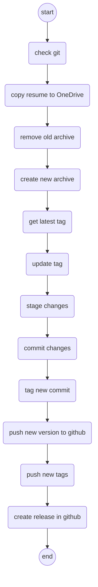

# Resume

Repository that holds the current version of my resume.

## How-To use

1. Update the necessary information in the resume, ensure to include the pdf update as well.
2. Execute the script:

    ```bash
    .\release.ps1 -ReleaseType "<major | minor | patch>" -CommitMessage "<add message here>"
    ```

3. Go to GitHub and do the release.

## Script process


